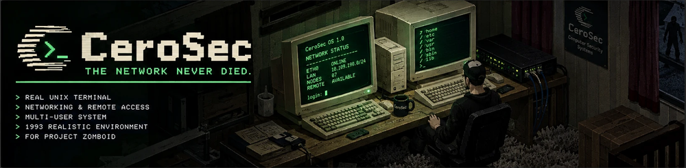

# CeroSec

**THE NETWORK NEVER DIED.**

A small Unix on the vanilla desktop computers of Knox County: switch one on, sit
down at it, and a green 60x20 terminal opens on a BIOS line and a login prompt.
Behind it are files, permissions, accounts, an editor, shell scripts, cron, the
doors and lights of the building under `/dev`, and three ways off the machine:
coax to the rest of the building, a modem to the county, a radio past both. From
scratch, vanilla Lua only, server-authoritative, Build 42.

Made by Konijima.

## Status

Build 42.20.4. From scratch, vanilla Lua only, no dependencies.

Done: the OS engine (filesystem, permissions, accounts, groups, a real shell
language with pipes and job control), cron, the manual as a three-volume in-game
documentation set, floppy disks with their own filesystem, the device network
under `/dev` (doors, switches, motion sensors) and the four hardware modules a
survivor has to fit before a computer reaches any of it, and three links out to
the rest of the county — coax to the other machines in a building, the telephone, and radio.
See "Documentation" below for where each of those is written up.

What's next: `CeroSec.DEV_MANUAL_MENU` (`42/media/lua/shared/CeroSec/CeroSecDefs.lua`)
is still `true`. It is a testing aid that puts a manual reader on every computer's
right-click menu regardless of whether anyone has found a book, and it **has to be
set to `false` before the Workshop release**.

## Install (local play)

Clone or drop this repo at `~/Zomboid/mods/CeroSec` — as a real directory, **never**
a symlink — and enable **CeroSec** in the mod list when starting or loading a game.

The real-directory rule is not a preference: Build 42's `ScriptManager` resolves
each `media/scripts` file against the mod's canonical, symlink-resolved path while
it is *found* through the link, so the relative path degenerates into the full
absolute path and every script fails with `FileNotFoundException`. Lua and
translations are unaffected; scripts are not, so the whole mod has to sit where it
is loaded from. See [docs/CONTRIBUTING.md](docs/CONTRIBUTING.md#repository-layout).

## Quick start (players)

1. Right-click a desktop computer and choose **Turn on computer** (needs power).
2. Right-click again for **Use computer** to sit down and open the terminal.
3. At `login:`, use `admin` or `root`, both with an empty password — press Enter.
4. `dev` lists what the machine can reach; `help` lists the commands. A door,
   window or light is only on that list once somebody has screwed a CeroSec
   module to it — right-click the fixture itself, **CeroSec hardware** — unless
   the sandbox option `CeroSec.HardwareRequired` is turned off.
5. Click the window's close button, or type `exit`, to walk away — the screen
   keeps running and is exactly as you left it next time.

Full player reference: [docs/PLAYERS.md](docs/PLAYERS.md).

## Design rules (non-negotiable)

- **Vanilla only.** No dependencies, no bundled libraries.
- **Nothing is called on faith.** Every game API used is proven to exist first,
  against the shipped jar (`javap`) or against vanilla Lua.
- **No Lua is ever evaluated from a file.** The OS core reads and writes plain
  data; nothing a player types or a script contains is ever handed to `load` or
  `loadstring`. `tests/kahlua-check.sh` greps for the constructs that would
  smuggle one in.
- **Faithful to Unix; invent nothing.** Where a real `/bin/sh`, `cron`, `rlogin`
  or a Hayes modem would answer a certain way, this machine answers the same way
  — refusals included. A behaviour with no real-world model is a behaviour to
  question.
- **Waves in worktrees.** Each wave of work happens in its own git worktree
  branched from a named base commit, is proven by `sh tests/run.sh` and never by
  starting the game, and merges only after a verifier reads the diff and Mathieu
  says `go`. See [docs/CONTRIBUTING.md](docs/CONTRIBUTING.md).
- **Never `eval`, in either direction.** Not Lua evaluated from a file, and not
  a player-supplied string reaching Lua's own pattern matching unescaped.

Three lessons this codebase paid for and does not intend to relearn:

- **The mod folder is a real directory, never a symlink** — a symlinked mod
  folder loads its Lua fine and fails every script with `FileNotFoundException`,
  because `ScriptManager` resolves through the link before it matters. See
  "Install" above.
- **`MeasureStringX` measures a glyph's ink, not its advance** — the manual
  reader sized its monospaced column on the *ink* of `"M"` until a wave that
  measured the gap between two of them instead, because `"M"` in the game's own
  font is a pixel wider in ink than the cell it is drawn in. See
  [docs/ARCHITECTURE.md](docs/ARCHITECTURE.md#the-manual-reader).
- **`rlogin` needs a terminal to hand over** — a job with nobody in front of it
  (a cron line, a background job, a pipe stage, a `$(...)`) has nothing to give
  a remote shell and is refused, in `rlogin`'s own words, exactly as real
  `rlogin(1)` refuses one. See [docs/PROTOCOL.md](docs/PROTOCOL.md).

## Documentation

- [docs/PLAYERS.md](docs/PLAYERS.md) — everything a player needs out of game:
  accounts, commands, the editor, devices, the network, floppies, the manual.
- [docs/ARCHITECTURE.md](docs/ARCHITECTURE.md) — the engine, the server, the
  client, the system files, the BIOS, persistence, the manual reader.
- [docs/PROTOCOL.md](docs/PROTOCOL.md) — the client/server wire: messages, the
  screen shape, control markers, completion, device highlighting, remote sessions.
- [docs/DEVICES.md](docs/DEVICES.md) — how `/dev` is built, the sync calls proven
  against the jar, motion sensors, and the floppy's own filesystem.
- [docs/NETWORK.md](docs/NETWORK.md) — coax, the telephone and the radio: their
  identities, their rules and rates, and the sessions they carry.
- [docs/SCRIPTING.md](docs/SCRIPTING.md) — the shell language, pipes, cron, job
  control, and the step machine and scheduler underneath.
- [docs/TESTING.md](docs/TESTING.md) — `sh tests/run.sh`, what each suite proves,
  and the manual checklists for what no headless test can reach.
- [docs/CONTRIBUTING.md](docs/CONTRIBUTING.md) — the wave process, repository
  layout, and coding and security rules.
- [docs/SECURITY.md](docs/SECURITY.md) — the password hash, what root can and
  cannot undo, and what the server guarantees against a hostile script.
- [docs/RELEASE.md](docs/RELEASE.md) — the ordered Workshop release checklist:
  the images, the flags, the upload, the tag, the visibility.

The in-game manual's own text lives in
[`42/media/lua/shared/CeroSec/CeroSecManualUser.lua`](42/media/lua/shared/CeroSec/CeroSecManualUser.lua),
[`CeroSecManualAdmin.lua`](42/media/lua/shared/CeroSec/CeroSecManualAdmin.lua) and
[`CeroSecManualProgrammer.lua`](42/media/lua/shared/CeroSec/CeroSecManualProgrammer.lua).
The in-game (not headless) test checklists are
[docs/PARCOURS-TEST.md](docs/PARCOURS-TEST.md), [docs/TEST-rung1.md](docs/TEST-rung1.md),
[docs/TEST-rung2.md](docs/TEST-rung2.md) and [docs/TEST-rung4.md](docs/TEST-rung4.md).
